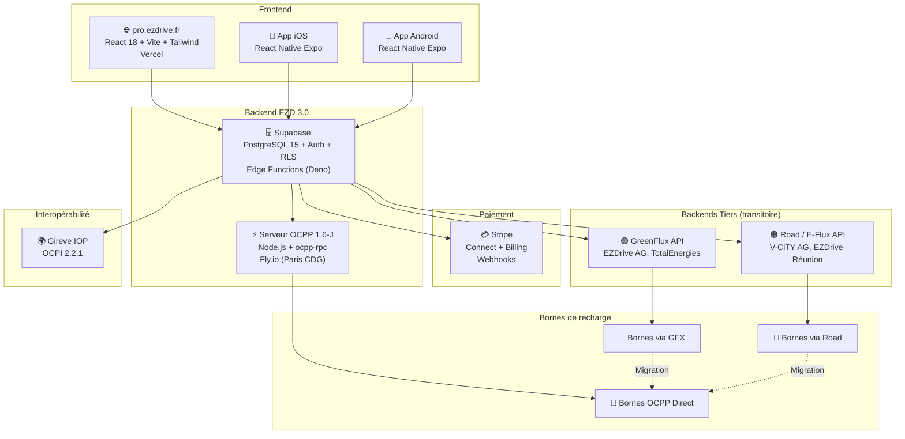
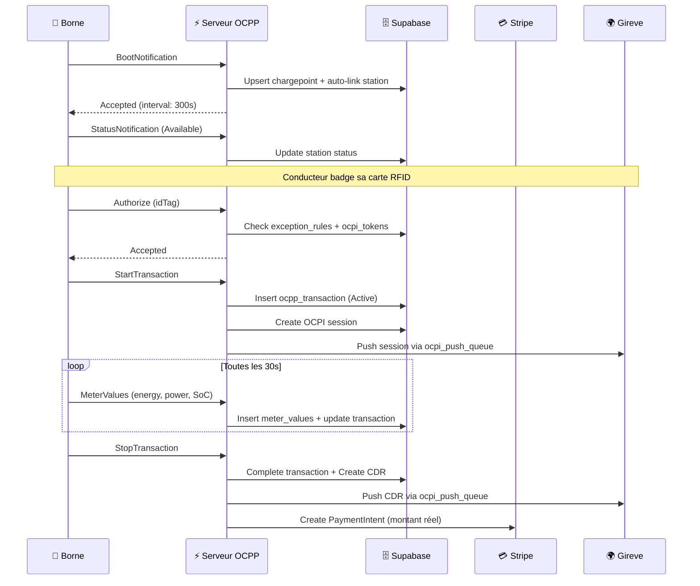
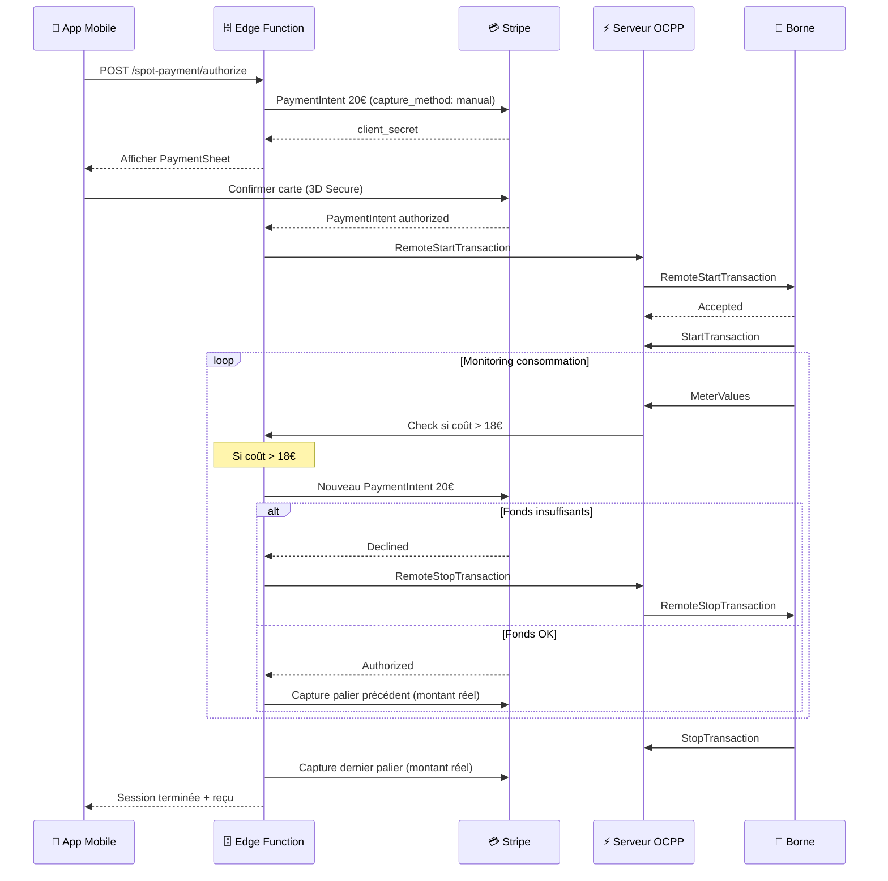
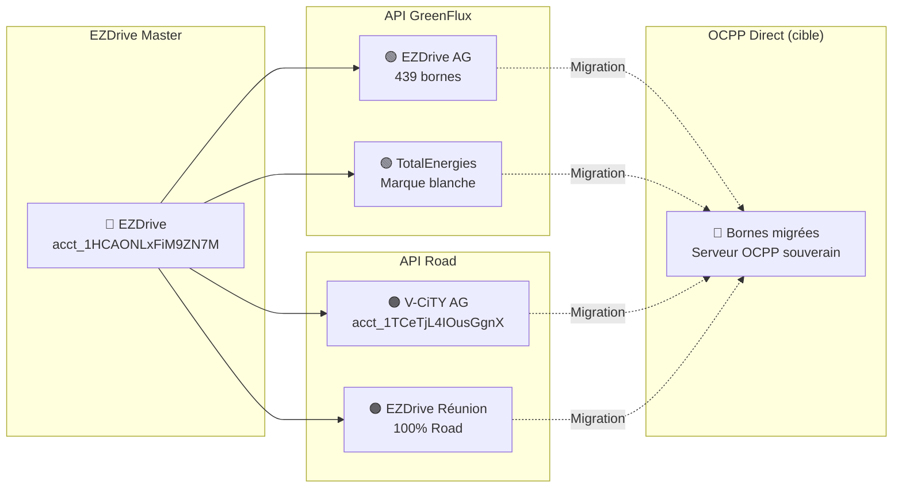
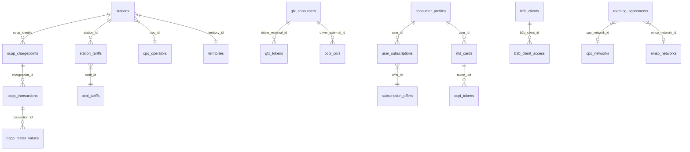

# Architecture EZDrive 3.0 — Diagramme interactif

## Vue d'ensemble

## Flux de charge OCPP Direct

## Flux Paiement SPOT (CB pré-autorisation)

## Architecture sous-CPO

## Tables principales

## Infrastructure de déploiement

| Composant | Service | Région | URL |
|-----------|---------|--------|-----|
| Frontend | Vercel | Auto (Edge) | pro.ezdrive.fr |
| Base de données | Supabase PostgreSQL 15 | eu-west-1 | phnqtqvwofzrhpuydoom.supabase.co |
| Edge Functions | Supabase Deno | eu-west-1 | .../functions/v1/* |
| Serveur OCPP | Fly.io | cdg (Paris) | wss://ezdrive-ocpp.fly.dev |
| Paiement | Stripe | EU | dashboard.stripe.com |
| DNS | Vercel DNS | Global | ezdrive.fr |

## Ports et protocoles

| Service | Protocole | Port | Auth |
|---------|-----------|------|------|
| Frontend | HTTPS | 443 | Supabase JWT |
| API REST | HTTPS | 443 | Bearer JWT |
| OCPP WebSocket | WSS | 443 | Identity in URL |
| Supabase Realtime | WSS | 443 | API Key |
| Stripe Webhook | HTTPS | 443 | Signature whsec_ |
